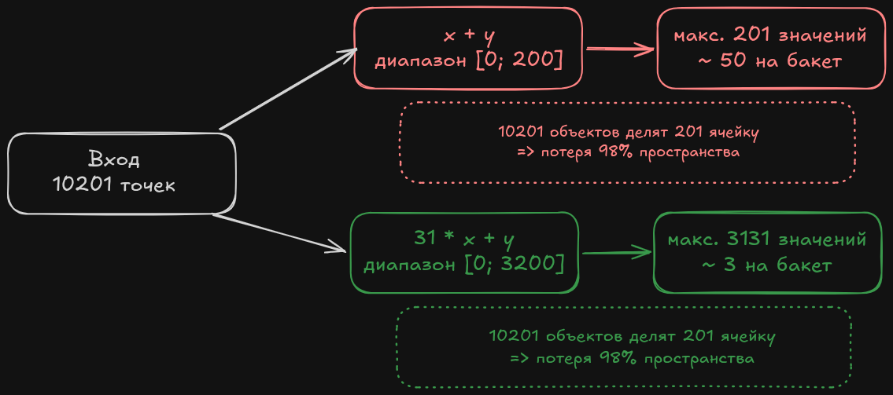
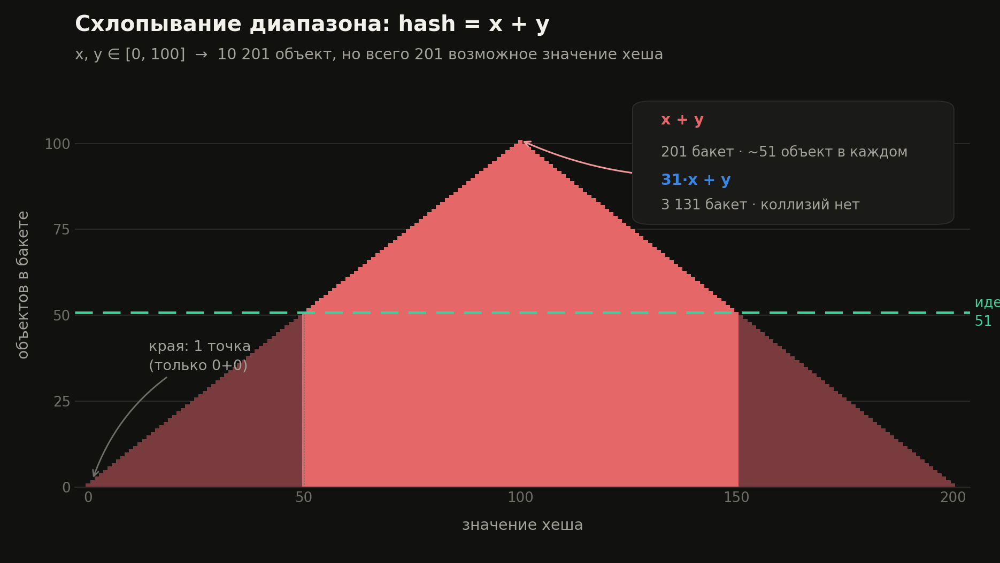

Метод `Objects.hash(Object... values)` использует `Arrays.hashCode()`, а имплементация `hashCode()` в `Arrays` выглядит так:
```
public static int hashCode(Object a[]) {
    if (a == null) return 0;
    int result = 1;
    for (Object element : a)
        result = 31 * result + (element == null ? 0 : element.hashCode());
    return result;
}
```

Также, как пример, можем взять `AbstractList.hashCode()`:
```
public int hashCode() {
    int hashCode = 1;
    for(E e : this) {
        hashCode = 31 * hashCode + (e == null ? 0 : e.hashCode());
    }
    return hashCode;
}
```

Как видно, в имплементациях встречается формула **`31 * x + y`** и в данной статье я постараюсь ответить на два вопроса:
* **Что будет если убрать множитель 31?**
* **Почему именно 31?**

... a под конец объясню какую слабость имеет существующая формула и как ее компенсирует HashMap.

---


## Вопрос 1: что будет, если убрать множитель 31?

Если избавимся от множителя, то появятся три проблемы:

### 1. Симметрия => коллизия при перестановке

```
hash(1, 2) = 3
hash(2, 1) = 3
```

Точка (1,2) и точка (2,1) - разные объекты, но получают одинаковый хеш. Неизбежная коллизия.

***От перестановки мест слагаемых сумма не меняется.***

Со строками ещё нагляднее - если бы `String.hashCode()` был просто суммой символов, то `"abc"`, `"acb"`, `"bac"`, `"bca"`, `"cab"`, `"cba"` имели бы **один и тот же хеш**. Сложение не видит порядок.

### 2. Схлопывание диапазона

Пусть x, y ∈ [0, 100]. Всего пар: 101² = **10 201**.
 
Но `x + y` может принять значения только от 0 до 200 - это **201 различное значение**.
 
То есть 10 201 объект размазывается по 201 бакету: в среднем **~50 объектов на бакет** вместо одного. HashMap деградирует.
 
Для сравнения: `31 * x + y` на тех же входах даёт значения вплоть до `31 * 100 + 100 = 3200` - на порядок шире, и пока `y < 31`, отображение вообще биективно: каждая пара получает **уникальный** хеш.



### 3. Треугольное распределение вместо равномерного

Мало того что значений всего 201 - они ещё и распределены неравномерно, а **треугольником**:
 
* сумма 0 => 1 способ: (0, 0)
* сумма 100 => 101 способ: (0,100), (1,99), … (100,0)
* сумма 200 => 1 способ: (100, 100)

  

По картинке видно, что центральные бакеты забиты, крайние почти пусты. А хеш-функция обязана быть **равномерной**.

### Вывод

Если заменить `31 * x + y` на `x + y`, контракт метода `hashCode()` формально **не нарушится** - контракт требует только ***равные объекты => равные хеши***, обратное не требуется.
 
Технически даже `return 0;` - корректный `hashCode()`. Он просто превращает HashMap в связный список с поиском за O(n). Контракт - про **корректность**, а качество распределения - про **производительность**.

---


## Вопрос 2: почему именно 31?

Ответ Джошуа Блоха в книге ***Effective Java (3rd edition)***, Item 11:
 
> Значение 31 выбрано потому, что оно является нечётным простым числом.
> Если бы оно было чётным и умножение приводило к переполнению, то происходила бы потеря информации, потому что умножение на 2 эквивалентно сдвигу.
> Преимущество использования простых чисел менее понятно, но это традиционная практика.
> Приятным свойством 31 является то, что умножение можно заменить сдвигом и вычитанием для повышения производительности на некоторых архитектурах: `31 * i == (i << 5) - i`.
> Современные виртуальные машины выполняют оптимизацию такого вида автоматически.

Обратите внимание: **сам Блох признаёт, что аргумент про простоту слабый** - он пишет "менее понятно, но традиционно". Разберём все аргументы и оценим, какие из них реально работают.

### Аргумент 1: нечётность - единственный строгий


Это математика. Умножение на четное число необратимо теряет биты при сдвиге. Так как, `каждое умножение на 2 = свдиг 1 бита налево.`

То есть если взять 32-битное представление числа 13 и умножить его на самое маленькое четное число 2:

```
13     = 0000 0000 0000 0000 0000 0000 0000 1101
13 * 2 = 0000 0000 0000 0000 0000 0000 0001 1010
                                               ^
                                   младший бит = 0 гарантированно
```

Биты сдвинулись влево, а справа **добавился ноль**. И вот это ключевое: не "старшие биты вылетели" (переполнение есть при любом множителе, в том числе при 31 - это нормально), а **младшие разряды забились нулями, и туда больше нечего записать**. И чем больше степень 2, тем быстрее старшие биты теряются, взамен на нулевые младшие биты.

```
n * 2   = n << 1   => 1 младший бит гарантированно 0
n * 4   = n << 2   => 2 младших бита гарантированно 0
n * 32  = n << 5   => 5 младших бит гарантированно 0
```

После каждой итерации накопления в младших битах растёт мёртвая зона нулей. А HashMap выбирает бакет **именно по младшим битам** (`h & (n - 1)`) - то есть смотрит ровно в ту часть числа, которую мы своими руками обнулили.
 
Важно: проблема не только у степеней двойки. Умножение на 6 (= 2 · 3) тоже теряет один бит, потому что 6 делится на 2.
 
Это единственный из аргументов, который **доказывается**, а не декларируется.
   
### Аргумент 2: оптимизация `(i << 5) - i`

Компилятор раскладывает `31 * x` в сдвиг и вычитание:
 
```
31 = 32 - 1
31 * x = (x << 5) - x
```

На примере числа 13:

```
13      = 0000 0000 0000 0000 0000 0000 0000 1101   (13)
13 << 5 = 0000 0000 0000 0000 0000 0001 1010 0000   (416)
 
  0000 0000 0000 0000 0000 0001 1010 0000   (416)
- 0000 0000 0000 0000 0000 0000 0000 1101   (13)
= 0000 0000 0000 0000 0000 0001 1001 0011   (403)
```

Обратите внимание на результат: младший бит равен **1**. Нулевого "хвоста" не появилось - именно потому, что 31 нечётное. Сравните с умножением на 2 выше, где младший бит гарантированно 0.

**Но сегодня это не аргумент в пользу 31.** Так как современные виртуальные машины выполняют оптимизацию (разложение умножения в сдвиге при любой константе) автоматически.

### Аргумент 3: величина

Множитель определяет, **насколько быстро вклад старого поля выталкивается за границу 32 бит**. Чем больше множитель, тем сильнее сдвиг за одну итерацию.

* **Слишком маленький множитель** (например, 3):
  Сдвиг всего ~1.6 бита за шаг. Вклад полей растёт медленно, старшие биты долго остаются нулями. Хеши кучкуются в узком диапазоне, значительная часть 32-битного пространства не используется.

* **Слишком большой множитель** (например, 1000003):
  Сдвиг ~20 бит за шаг. Уже через 2 итерации вклад раннего поля выталкивается за пределы 32 бит. Хеш начинает зависеть **только от последних 1–2 полей**. Строки с одинаковым окончанием схлопываются в один хеш.

* **31 ≈ 2⁵ - золотая середина:**
  Сдвиг ~5 бит за шаг (log₂31 ≈ 4.95). При 32-битном слове это значит: **вклад поля живёт примерно 6–7 итераций** до вытеснения.

**Почему 6–7 - это хорошо?** Это компромисс между двумя требованиями:

* достаточно **быстро**, чтобы за несколько символов заполнить все 32 бита энтропией (не оставить мёртвых нулевых зон, как при множителе 3);
* достаточно **медленно**, чтобы вклад поля не умирал через одну итерацию (как при 1000003).
  
Для типичных строк и объектов с 3–5 полями окно в 6–7 итераций попадает точно в нужный диапазон.

---

## Чего эта формула не умеет
 
Важное дополнение, о котором обычно молчат.
 
Хорошая хеш-функция должна обладать **лавинным эффектом**: изменение одного бита входа меняет каждый бит выхода с вероятностью ≈ 0.5.
 
`31 * h + c` этим свойством **не обладает**. Умножение распространяет биты только **влево** - старшие биты результата никогда не влияют на младшие. Диффузия односторонняя.
 
Настоящие хеш-функции чинят это финальным перемешиванием. Например, murmur3 прогоняет число через чередование умножений и сдвигов вправо:
 
```java
h ^= h >>> 16;
h *= 0x85ebca6b;
h ^= h >>> 13;
h *= 0xc2b2ae35;
h ^= h >>> 16;
```
 
XOR со сдвигом **вправо** возвращает информацию из старших битов в младшие - это и есть недостающая половина диффузии.  (Полный разбор murmur3 - тема отдельной статьи, здесь важно лишь, что она делает то, чего `31 * x` не умеет.)

---

## Как HashMap компенсирует слабость формулы

И вот здесь самое интересное. **HashMap знает о слабости `31 * x` и подстраховывается сам.** Чтобы понять как, нужно сначала разобраться, как HashMap выбирает бакет.

### Бакет выбирается по младшим битам
 
У HashMap внутри - массив бакетов (ящиков). Пусть их 16. В какой из 16 положить ключ? Напрашивается `hash % 16`, но операция взятия остатка медленная. Поэтому для размеров, кратных степени двойки, используют быстрый трюк:
 
```java
index = hash & (16 - 1)     // = hash & 15 = hash & 0b1111
```
 
`& 15` означает "взять только последние 4 бита", всё остальное отбрасывается.
 
Вот в чём засада: выбор бакета зависит **только от младших битов** хеша. А мы только что выяснили - у `31 * x` младшие биты самые бедные и предсказуемые. То есть HashMap по умолчанию смотрел бы ровно туда, где меньше всего пользы, а старшие биты (где вся энтропия) вообще не участвовали бы в выборе бакета.

### Строчка, которая всё чинит
 
Посмотрите на приватный метод `HashMap.hash()`:
 
```java
static final int hash(Object key) {
    int h;
    return (key == null) ? 0 : (h = key.hashCode()) ^ (h >>> 16);
}
```

Вся магия в `h ^ (h >>> 16)`, которая является урезанным murmur-финализатором. Разберём по частям:
 
* `h >>> 16` - сдвигаем число на 16 бит **вправо**. Старшие 16 бит переезжают на место младших.
* `h ^ (...)` - XOR подмешивает эти богатые старшие биты в бедные младшие.
Разберём на конкретном числе. Пусть хеш = `0xA3B8_002C` (обратите внимание: младшая половина почти пустая - как раз типичная беда `31 * x`):

```
h        = 1010 0011 1011 1000   0000 0000 0010 1100
h >>> 16 = 0000 0000 0000 0000   1010 0011 1011 1000
                                 старшие уехали вниз
XOR:
h        = 1010 0011 1011 1000   0000 0000 0010 1100
h>>>16   = 0000 0000 0000 0000   1010 0011 1011 1000
----------------------------------------------------
result   = 1010 0011 1011 1000   1010 0011 1001 0100
                        младшие биты ТЕПЕРЬ содержат "эхо" старших
```
 
Проверим, что это меняет реальный выбор бакета (берём последние 4 бита):
 
```
до перемешивания:   0xA3B8002C & 15 = 12   => бакет 12
после перемешивания: результат & 15 = 4    => бакет 4
``` 

Строчка реально изменила бакет - потому что подмешала информацию из старшей половины, которую `& 15` иначе бы просто выбросил.

### Почему именно `>>> 16`
 
Число 32-битное, и сдвиг ровно на половину (16) складывает верхнюю половину с нижней - максимальное перемешивание за одно дешёвое действие. Один сдвиг плюс один XOR - и всё. HashMap вызывается миллионы раз, поэтому важна каждая инструкция: взяли самый дешёвый приём, который заметно улучшает плохие хеши и почти не портит хорошие.


### Родство с murmur3
 
Приглядитесь: `h ^ (h >>> 16)` - это буквально **первая строчка** murmur3-финализатора из предыдущего раздела, только без умножений. JDK взял от murmur самый дешёвый кусочек - ровно столько, чтобы починить главную проблему (перекос энтропии в старшие биты), но не платить за полную хеш-функцию.
 
Главная мысль:
 
> HashMap **не доверяет** вашему `hashCode()`. Он исходит из того, что вы (или `String`, или `Integer`) сложили всю энтропию в старшие биты, и подстраховывается - подмешивает их в младшие, потому что смотреть при выборе бакета будет именно на младшие.

----
## Итог

**31 - не оптимум, а исторически закреплённый разумный компромисс.** Числа 33, 37 или 131 работали бы не хуже.
 
Но есть нюанс: `String.hashCode()` **зафиксирован в спецификации Java**. В JavaDoc записана точная формула `s[0]*31^(n-1) + ... + s[n-1]`, а значит, `"cat".hashCode()` обязан возвращать 98262 в любой версии JDK, на любой платформе, всегда. Это часть публичного контракта - за 20+ лет люди построили на этом системы (шардирование, персистентные кеши), и сломать обещание нельзя.
 
А вот в **своих** классах вы не связаны ничем. Контракт требует только "равные объекты => равные хеши". Можете взять 33, murmur3, xxHash - и будете правы. То, что все пишут 31, - это культурная норма, а не техническое требование.

А как выглядит хеш, у которого лавинный эффект есть с самого начала - murmur3 - разберу в отдельной статье.